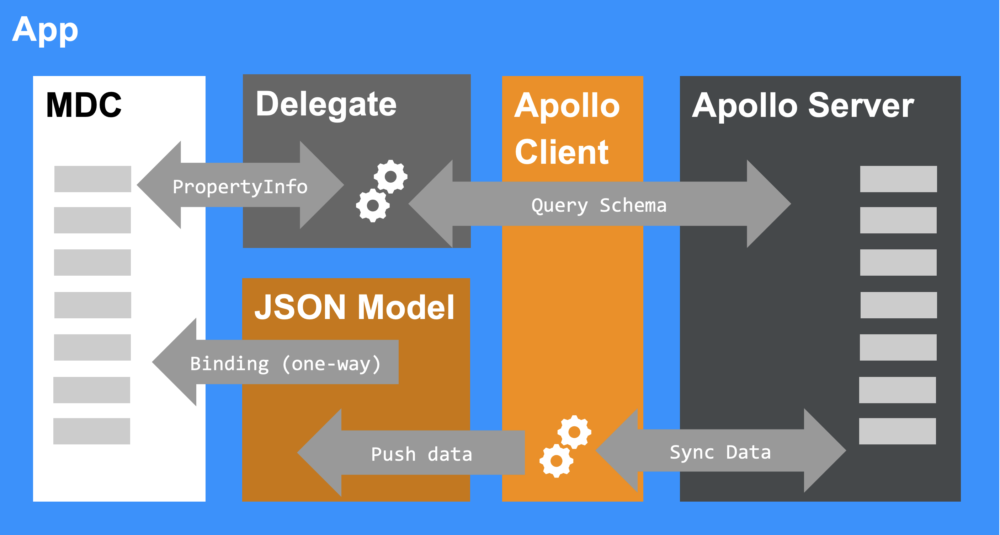

# ui5con-graphql-mdc
This repository contains a sample for our UI5Con 2024 session "GraphQL and sap.ui.mdc: A Powerful Team for Metadata-Driven Apps", demonstrating the synergies between GraphQL via Apollo Server/Client and MDC. See the [slides](https://github.com/bendkt/ui5con2024-graphql-mdc/blob/458853c5a0a7c22941741e4a67bde536cf325e5d/2024_UI5con_MDC_GQL.pdf) for more information.

## install dependencies
You'll need to have Yarn installed in order to install the whole setup. 
```console
yarn
```

## run the project (starts the GraphQL and UI5 server)
```console
yarn start
```
Afterwards you can access the app on localhost:8080.

## architecture
To give a little orientation of what happens where:
### significant artifacts
* Component: Creates the Apollo Client
* ApolloController: Sets up the UI5/GQL integration with JSONModel
* GQLPropertyInfo: Retrieves and maps the GQL schema to MDC PropertyInfo
### overview (brief and simplified)


## links
* https://github.com/petermuessig/ui5-sample-apollo-reloaded
* https://openui5.org/ui5con/germany2024/
